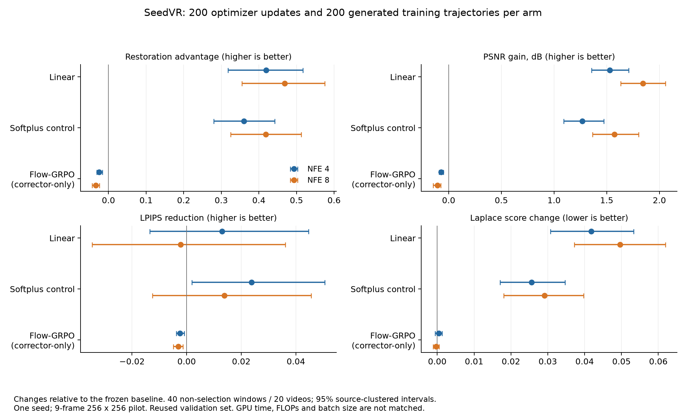
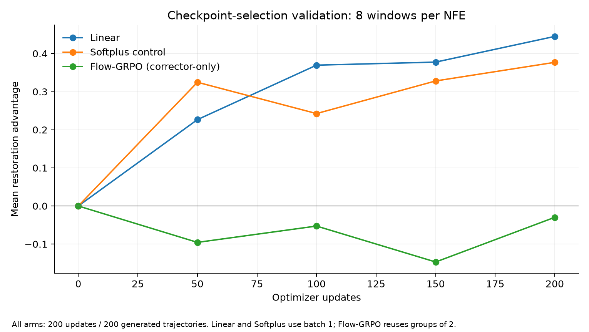

# SeedVR：Softplus 与 Linear 奖励项参数化

更新：2026-09-17。实验：`seedvr_linear_budget_v1`。本文记录已经完成的离线修正场训练，不是每个测试样本上的在线优化。

## 1. 发现及建议名称

**建议把这项消融命名为：Reward-gradient saturation ablation（奖励梯度饱和消融）。** 具体观察可称为 **Softplus–Linear restoration–perception trade-off（Softplus–Linear 恢复与感知质量权衡）**。这些是描述性名称，不宣称发现了新的普遍定律。

保留两个正式 reward-term 选项：**Softplus** 和 **Linear**。改变的是终点标量损失对 advantage 的映射，不是修正场网络结构、推理求解器或 IPO quadratic target margin。

可直接用于实验总结：

> 在冻结 SeedVR-3B、仅训练修正场的离线优化中，我们比较了初始梯度幅度匹配的 Softplus 与 Linear 终点目标。在相同的 200 次更新和 200 条训练生成轨迹下，Linear 获得了更高的最终恢复 advantage 和 PSNR，但 LPIPS 与特征核得分更差。该现象与 Softplus 在正 advantage 区域的梯度衰减相一致，但尚不能证明梯度衰减是唯一原因，也不能证明 Linear 普遍收敛更快或在同算力预算下更优。

**不能写成“Linear 和 hybrid 已证明优化更快”。** 本轮完成的是纯 Softplus、纯 Linear，参考组为之前的 Flow-GRPO 适配版；没有完成本轮同预算的 Softplus+Linear 混合项实验。旧的奖励项+特征核实验是另一维度的消融。

## 2. 公共定义：冻结主模型、配对终点和恢复 advantage

以从噪声到终点的归一化时间表示，固定 NFE 为 N：

```math
x_{k+1}=x_k+\frac1N\left[v_0(x_k,k/N;c)+c_\phi(x_k,k/N,c,N)\right].
```

主模型 v₀ 与解码器 D 冻结，只训练 562,000 参数的修正场 cφ。代码保持官方 Euler 运算次序，上式表示其数学形式。令同一输入条件 c、初始噪声 z、NFE 下的解码结果为：

```math
X_\phi=D(F_\phi^N(z,c)),\qquad X_0=D(F_0^N(z,c)).
```

以 HQ 视频 y 为目标；T 为帧数，M 为全部像素坐标数，所有损失越小越好：

```math
\ell_{\mathrm{charb}}(X,y)
=\frac1M\sum_{p=1}^{M}\sqrt{(X_p-y_p)^2+10^{-6}},
```

```math
\ell_{\mathrm{LPIPS}}(X,y)
=\frac1T\sum_{t=1}^{T}\operatorname{LPIPS}_{\mathrm{Alex}}(2X_t-1,2y_t-1),
```

```math
\ell_{\mathrm{temp}}(X,y)
=\operatorname{mean}_{t,p}\left|
(X_{t+1,p}-X_{t,p})-(y_{t+1,p}-y_{t,p})\right|.
```

这里是有监督的相邻帧差分误差，不是光流 warping loss。视频按解码后的 [0,1] 标度计算这些训练项，未在训练损失前裁剪输出；PSNR 评估使用裁剪到 [0,1] 的输出。

每个 NFE、每个损失分量的尺度 sⱼ,N 是 16 个训练集校准窗口上 base 损失的样本标准差，最小值 0.001，之后冻结。权重固定为 (0.7, 0.2, 0.1)：

```math
A_\phi=\sum_{j=1}^{3}w_j
\frac{\operatorname{sg}[\ell_j(X_0,y)]-\ell_j(X_\phi,y)}{s_{j,N}},
\qquad w=(0.7,0.2,0.1).
```

sg 表示停止梯度。A>0 表示组合恢复损失优于同噪声 base。PSNR 是报告指标，不直接作为本轮训练项。

## 3. 两种正式参数化：全部以最小化 loss 为准

### Softplus：基于相对收益的梯度衰减

```math
\mathcal L_{\mathrm{SP}}(\phi)
=\mathbb E\left[\tau\log(1+\exp(-A_\phi/\tau))\right],
\qquad \tau=0.1.
```

单样本标量损失的导数为：

```math
\frac{dL_{\mathrm{SP}}}{dA}=-\sigma(-A/\tau),
\qquad \nabla_\phi L_{\mathrm{SP}}
=-\sigma(-A_\phi/\tau)\nabla_\phi A_\phi,
```

其中 σ 是 sigmoid。更精确的说法是 **advantage-dependent gradient attenuation（随 advantage 变化的梯度衰减）**，或 **positive-advantage gradient saturation（正 advantage 区域的梯度饱和）**。

- A<0：更重视仍然比 base 差的样本。
- A=0：梯度权重为 0.5。
- A≫τ：继续提升的梯度权重接近 0，但有限 A 下仍指向更大的 advantage，不会把 A 拉回 0。

**这不是信赖域约束（trust-region constraint），也不是 KL 正则。** 它没有显式约束输出距离、修正场范数或生成分布到 base 的距离；可能倾向于更保守的更新，但不保证模型接近 base。即使标量 reward 相同，两个输出也可以相差很大。本轮也未用距离统计证明 Softplus 产生了更小的参数或输出位移。

### Linear：保持非零的标量 reward 梯度

```math
\mathcal L_{\mathrm{LIN}}(\phi)=\mathbb E[-\alpha A_\phi],
\qquad \alpha=0.5,
```

```math
\frac{dL_{\mathrm{LIN}}}{dA}=-0.5,
\qquad \nabla_\phi L_{\mathrm{LIN}}=-0.5\nabla_\phi A_\phi.
```

α=0.5 匹配 Softplus 在 A=0 处的导数，避免起点就是两倍梯度。梯度权重示例：

| A（τ=0.1） | Softplus 的 −dL/dA | Linear 的 −dL/dA |
|---:|---:|---:|
| −0.3 | 0.9526 | 0.5000 |
| 0 | 0.5000 | 0.5000 |
| +0.3 | 0.0474 | 0.5000 |
| +0.5 | 0.0067 | 0.5000 |

Linear 只消除了这层标量映射的饱和，不保证整个网络梯度不消失。这里的损失分量非负，因此本任务的 A 有由 base 损失决定的上界；不能据“linear”就断言实际任务 reward 可无限增长。

固定配对和尺度后，Linear 中的 base 仅是对 φ 无关的常数：

```math
\nabla_\phi\mathcal L_{\mathrm{LIN}}
=0.5\,\mathbb E\left[\sum_j\frac{w_j}{s_{j,N}}
\nabla_\phi\ell_j(X_\phi,y)\right].
```

因此其训练梯度等价于直接最小化这组加权终点损失；base 仍用于定标、配对报告和选模，但不再通过非线性映射改变单样本梯度权重。

两者 batch=1 时，对同一个 φ 和样本，梯度方向相同而幅度不同。实际轨迹还受 AdamW 的历史状态和梯度裁剪影响，不能把解析权重比例直接视为参数更新比例。

如果用“最大化 reward”的记号，两者分别为 R_SP(A)=−τ log(1+exp(−A/τ)) 和 R_LIN(A)=0.5A；不能只翻转外部正负号而保持内部符号不变。

## 4. Hybrid 的两种含义，以及旧文档中的符号差异

### 4.1 Softplus + Linear 混合损失：本轮未训练

可定义候选项：

```math
L_{\mathrm{hybrid}}(A)
=\tau\log(1+\exp(-A/\tau))-\lambda A,\qquad\lambda>0,
```

```math
\frac{dL_{\mathrm{hybrid}}}{dA}
=-\sigma(-A/\tau)-\lambda.
```

这会在正 advantage 很大时保留至少 λ 的标量梯度幅度。这里的“linear drift”是损失中的线性倾向，不是额外加入推理动力学的第二个速度场。若做同初始斜率消融，可再乘 0.5/(0.5+λ)。它只作为待检验的说明，不新增为已验证的第三种正式选项。

**旧 reward guide 中的 `-tau * softplus(A/tau)` 与本轮 Softplus 不相同。** 根据恒等式 softplus(a)=a+softplus(−a)：

```math
-\tau\operatorname{softplus}(A/\tau)
=-A-\tau\operatorname{softplus}(-A/\tau).
```

其导数为 −σ(A/τ)，会在大正 advantage 时趋近 −1，而不是趋近 0。注意右侧是 **负 Softplus − A**，不等于上面定义的 **正 Softplus − λA**。因此不能把旧公式与本轮保守型 Softplus 混用，也不能把其他模型的历史结果自动视为当前 hybrid 的证据。

### 4.2 奖励项 + 特征核项：独立于奖励参数化

原方法的联合目标可以写为：

```math
\widehat{\mathcal J}_p
=\frac1B\sum_{b=1}^{B}\frac1K\sum_{i=1}^{K}L_p(A_{bi})
+\frac\eta B\sum_{b=1}^{B}\widehat S_b,
\qquad p\in\{\mathrm{SP},\mathrm{LIN}\},
```

```math
\widehat S_b
=\frac{1}{2K(K-1)}\sum_{i\ne j}k(u_{bi},u_{bj})
-\frac1K\sum_i k(u_{bi},v_b),
\quad u_{bi}=\Psi(X_{bi}),\quad v_b=\Psi(y_b),
```

```math
k_{\mathrm{Lap}}(u,v)=\exp(-\|u-v\|_2/\sigma),
\qquad k_{\mathrm{Gauss}}(u,v)=\exp(-\|u-v\|_2^2/(2\sigma^2)).
```

核比较在冻结的 AlexNet 视频特征 Ψ 中计算，经解码器和 rollout 反传；不是在 Euler 步索引上计算。特征包含按顺序排列的帧特征和有符号时间差分。该 kernel score 省略与模型无关的 real–real 常数，不能作为绝对 MMD² 值报告。

旧 SeedVR 核实验使用 Softplus、K=2、η=0.1，100 次更新；**本轮两组均 η=0，200 次更新**，核得分只用于评估。Linear+kernel 以及同预算的混合损失尚未验证。不能用旧核实验来证明“hybrid 更快”。

## 5. 已完成实验结果

协议：REDS 划分，9 帧、256×256，固定合成退化，NFE=4/8；200 次更新、200 条训练生成轨迹。新两组复用初始化、样本/噪声顺序、尺度、AdamW lr=1e−4、无 weight decay、全局梯度裁剪 1。训练使用完整可微 rollout，主模型和奖励网络不更新。

在 8 个选模窗口上，于更新 50/100/150/200 选模；三个方法最佳均为更新 200。最终下表报告另 40 个窗口、20 个源视频。这些窗口在上一轮已查看过，本轮属于探索性复验。

| 方法 | NFE | 恢复 advantage ↑ | PSNR 增益 dB ↑ | LPIPS 减少 ↑ | 恢复胜率 ↑ |
|---|---:|---:|---:|---:|---:|
| Linear | 4 | +0.4192 | +1.529 | +0.0130 | 85.0% |
| Linear | 8 | +0.4684 | +1.843 | −0.0021 | 85.0% |
| Softplus | 4 | +0.3605 | +1.267 | +0.0238 | 87.5% |
| Softplus | 8 | +0.4188 | +1.575 | +0.0138 | 87.5% |
| 旧 Flow-GRPO 适配版 | 4 | −0.0246 | −0.072 | −0.0024 | 10.0% |
| 旧 Flow-GRPO 适配版 | 8 | −0.0337 | −0.108 | −0.0031 | 10.0% |

以上增益均相对同 NFE 的冻结 base。恢复胜率按 A>0 计算，不是 PSNR 胜率。

Linear 减去 Softplus 的配对 PSNR 差值为 +0.262 dB [0.161, 0.351] / +0.268 dB [0.105, 0.392]；LPIPS 减少量的差值为 −0.0108 [−0.0159, −0.0052] / −0.0160 [−0.0224, −0.0092]，即感知指标变差。区间按源视频 bootstrap 5000 次得到，未校正多重比较，也不包含训练 seed 不确定性。

Linear 相对旧 Flow-GRPO 的 PSNR 高 1.601 / 1.951 dB，但 LPIPS 改善的区间均跨零。



### 是否更快？

以下是选模集上的平均恢复 advantage，不是最终 40 窗口分数：

| 更新次数 | Linear | Softplus | 旧 Flow-GRPO |
|---:|---:|---:|---:|
| 50 | 0.2267 | **0.3247** | −0.0955 |
| 100 | **0.3696** | 0.2426 | −0.0527 |
| 150 | **0.3776** | 0.3282 | −0.1470 |
| 200 | **0.4451** | 0.3770 | −0.0297 |

早期 Softplus 领先，后面 Linear 领先。只有四个评估点和一个训练 seed，不能推断普遍更快的收敛率。两者最佳都在训练末尾，也不能声称已经收敛。



| 方法 | 更新次数 | 生成轨迹数 | 训练时间（分钟） | 峰值显存 GB |
|---|---:|---:|---:|---:|
| Linear | 200 | 200 | 28.67 | 62.4 |
| Softplus | 200 | 200 | 30.16 | 62.4 |
| 旧 Flow-GRPO | 200 | 200 | 7.41 | 37.4 |

时间只统计训练 group，不含加载、验证和最终评估。Linear 这一次比 Softplus 少约 4.9% 的时间，但没有重复计时，不能归因于标量损失的计算成本或宣称提速。它比旧 Flow-GRPO 耗时约 3.87 倍。

Flow-GRPO 使用两条 SDE 轨迹成组采集、两轮复用更新；新两组逐轨迹确定性 rollout 更新。因此仅匹配更新与采样数，不匹配 batch size、反向传播工作量、GPU 时间或 FLOPs。Flow-GRPO 是同修正场的 SeedVR 适配版，没有独立调参，不是官方完整模型训练的复现。

### 特征核和输出差异

K=2 诊断中，核得分变化为 corrected−base，越小越好：

| 方法 | NFE | Laplace 核变化 ↓ | Gaussian 核变化 ↓ | 输出间 LPIPS：base→corrected |
|---|---:|---:|---:|---:|
| Linear | 4 | +0.0418 | +0.0640 | 0.2814→0.2019 |
| Linear | 8 | +0.0496 | +0.0820 | 0.3158→0.2309 |
| Softplus | 4 | +0.0256 | +0.0386 | 0.2814→0.2204 |
| Softplus | 8 | +0.0291 | +0.0469 | 0.3158→0.2537 |
| 旧 Flow-GRPO | 4 | +0.0004 | +0.0007 | 0.2814→0.2841 |
| 旧 Flow-GRPO | 8 | −0.0003 | 约 0 | 0.3158→0.3203 |

Linear 的输出间差异减少更多，同时特征核得分更差。这与多样性收缩相一致，但 K=2 诊断不足以证明完整条件分布的变化机制。不能写“Linear 改善分布匹配”。

## 6. 结论边界与可检查记录

- 本轮支持“固定更新/采样预算下，Linear 最终恢复指标更高，伴随感知和核得分退化”。
- 解析导数证明 Softplus 会衰减正 advantage 的标量梯度；实验只说明结果与此机制一致，未排除 Adam、裁剪与随机训练差异的影响。
- 当前保留 Softplus 和 Linear 两种正式参数化，不把 hybrid 或 IPO quadratic 列为完成的本轮结果。
- 下一步若要声称加速，需要多 seed、预先定义的达标阈值、按更新数和 GPU 时间统计 time-to-target；若要声称更好泛化，需要未查看的测试集。UDM10/YouHQ40 尚未用于本轮。
- 本文不证明基座全参数训练、完整视频、其他退化或其他数据集上的同样结论。

记录：[汇总指标与配对区间](results/seedvr_linear_budget_v1/metrics.json)、[选模检查点记录](results/seedvr_linear_budget_v1/validation.json)。指标由已完成日志生成，并检查更新/轨迹数、base 一致性、选模划分及 checkpoint 哈希。本文只更新方法与结果文档，没有启动新训练。

参考：[原始有限 NFE 方法](finite_nfe_corrective_bridge_summary_github_ultrasafe.md)、[Reward guide](method_reward_guide.md)、[PyTorch Softplus 定义](https://docs.pytorch.org/docs/stable/generated/torch.nn.Softplus.html)。
